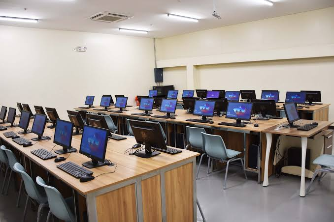

<!DOCTYPE html>
<html>
<head>
<title>Home</title>

</head>
<body>
  <h1>COMPUTER COLLEGE</h1>
  

  

    <table>
      <tr>
        <th><a href="HOME.html">HOME</a><th>
        <th><a href="Academic.html">ACADEMICS</a></th>
        <th><a href="ADMISSION.html">ADMISSION</a></th>
        <th><a href="ABOUT US.html">ABOUT US</a></th>
        <th><a href="LABARATORY.html">LABORATORY</a></th>
      </tr>
    </table>
  

  

  

    <table>
      <tr>
        <td>
          <marquee behavior="scroll" direction="left">
            
            
            
            
            
            
          </marquee>
        </td>
      </tr>
    </table>
  

</body>
</html> width as needed */
    max-width: 600px; /* Set a maximum width */
  }
  th {
    background-color: lightgray;
    border: 1px solid gray;
    padding: 10px;
    text-align: center;
  }
  h2 {
    color: green;
  }
  ul {
    color: green;
    list-style-type: square; /* Use square bullets for the list */
    padding-left: 20px; /* Add some left padding for better readability */
  }
  li {
    margin-bottom: 5px; /* Add some spacing between list items */
  }
  h4 {
    margin-top: 0; /* Remove default top margin for h4 within list items */
  }
</style>
</head>

<body>

  <h1>COMPUTER COLLEGE</h1>
  

  

    <table>
      <tr>
        
        <th><a href="HOME.html">HOME</a><th>
        <th><a href="ADMISSION.html">ADMISSION</a><th>
        <th><a href="ABOUT US.html">ABOUT US</a><th>
        <th><a href="LABARATORY.html">LABARATORY</a><th>
      </tr>
    </table>
  

  
 <h1>COURSES OFFERED</h1>
    <h2>TWO-YEAR COURSES</h2>
    <ul>
      <li><h4>TWO-YEAR COMPUTER TECHNICIAN</h4></li>
      <li><h4>TWO-YEAR INFORMATION TECHNOLOGY</h4></li>
    </ul>
      
    <h1>FOUR-YEAR COURSES</h1>
    <ul>
      <li><h4>BACHELOR OF SCIENCE IN COMPUTER SCIENCE</h4></li>
      <li><h4>BACHELOR OF SCIENCE IN COMPUTER INFORMATION TECHNOLOGY</h4></li>
      <li><h4>BACHELOR OF SCIENCE IN INFORMATION SYSTEMS</h4></li>
    </ul>
  

</body>
</html>        
